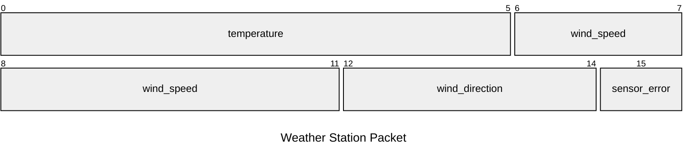

# Getting Started

As a motivating example, let's suppose we have a little weather station that
sends data over a serial connection. Say it uses a simple binary protocol that
packs the following information into two bytes:

| Bits  | Field Name       | Size (bits) | Description                                 |
| ----- | ---------------- | ----------- | ------------------------------------------- |
| 0-5   | `temperature`    | 6           | Temperature, Celsius (signed int)           |
| 6–11  | `wind_speed`     | 6           | Wind speed, km/h (unsigned int)             |
| 12–14 | `wind_direction` | 3           | Wind direction (0 = N, 1 = NE, ..., 7 = NW) |
| 15    | `sensor_error`   | 1           | Sensor error flag (1 = error)               |



Without a library like bydantic, parsing this information would require manual
bit manipulation and byte handling. For example, you might do something like
this:

```python
def parse_weather_data(data: bytes):
    if len(data) != 2:
        raise ValueError("Data must be two bytes")

    temperature = (data[0] & 0xFC) >> 2  # Mask and shift to get the first 6 bits
    if temperature & 0x20:  # Check if the sign bit is set
        temperature -= 64  # Convert to signed int

    # Get the last 2 bits from data[0], and the first 4 bits from data[1]
    wind_speed = (data[0] & 0x03) << 4 | (data[1] & 0xF0) >> 4

    wind_direction = (data[1] & 0x0E) >> 1  # Mask and shift (3 bits)

    sensor_error = (data[1] & 0x01) != 0  # Get the last bit

    return temperature, wind_speed, wind_direction, sensor_error

# Example usage:

parse_weather_data(b'\x00\x00')
# (0, 0, 0, False)

parse_weather_data(b'\xFF\xFF')
# (-1, 63, 7, True)
```

Serialization is just as tedious, requiring you to manually pack the data:

```python
def encode_weather_data(
    temperature: int,
    wind_speed: int,
    wind_direction: int,
    sensor_error: bool
) -> bytes:
    if not (-64 <= temperature <= 63):
        raise ValueError("Temperature must be between -64 and 63")

    if not (0 <= wind_speed <= 63):
        raise ValueError("Wind speed must be between 0 and 63")

    if not (0 <= wind_direction <= 7):
        raise ValueError("Wind direction must be between 0 and 7")

    if not isinstance(sensor_error, bool):
        raise ValueError("Sensor error must be a boolean")

    # Create a bytearray to hold the packed data
    data = bytearray(2)

    # Pack the temperature into the first 6 bits
    data[0] = (temperature & 0x3F) << 2

    # Pack the wind speed into the last 2 bits
    # of the first byte and the first 4 bits of
    # the second byte
    data[0] |= (wind_speed & 0x03) >> 4
    data[1] = (wind_speed & 0x0F) << 4

    # Pack the wind direction into the last 3 bits of the second byte
    data[1] |= (wind_direction & 0x07) << 1

    # Pack the sensor error into the last bit of the second byte
    data[1] |= 0x01 if sensor_error else 0x00

    return bytes(data)

# Example usage:

encode_weather_data(0, 0, 0, False) # b'\x00\x00'

encode_weather_data(-1, 63, 7, True) # b'\xFF\xFF'
```

This is a lot of boilerplate code to write and maintain, especially if you have
multiple fields or more complex data structures. This is where bydantic comes
in.

## Using bydantic

With bydantic, we can declaratively define the structure of our protocol using
Python classes and type hints, and then you get serialization / deserialization
methods for free. Here's how we would define the same weather data structure
using bydantic:

```python
import bydantic as bd
from enum import IntEnum

class WindDirection(IntEnum):
    N = 0
    NE = 1
    E = 2
    SE = 3
    S = 4
    SW = 5
    W = 6
    NW = 7

class WeatherData(bd.Bitfield):
    temperature: int = bd.int_field(6)
    wind_speed: int = bd.uint_field(6)
    wind_direction: WindDirection = bd.uint_enum_field(WindDirection, 3)
    sensor_error: bool = bd.bool_field()
```

Now that we have our data structure defined, let's deserialize some packets:

```python
WeatherData.from_bytes_exact(b'\x00\x00')
# WeatherData(
#   temperature=0,
#   wind_speed=0,
#   wind_direction=WindDirection.N,
#   sensor_error=False
# )

WeatherData.from_bytes_exact(b'\xFF\xFF')
# WeatherData(
#   temperature=-1,
#   wind_speed=63,
#   wind_direction=WindDirection.NW,
#   sensor_error=True
# )
```

Serializing the data back into bytes is just as easy:

```python
WeatherData(
    temperature=0,
    wind_speed=0,
    wind_direction=WindDirection.N,
    sensor_error=False
).to_bytes()
# b'\x00\x00'

WeatherData(
    temperature=-1,
    wind_speed=63,
    wind_direction=WindDirection.NW,
    sensor_error=True
).to_bytes()
# b'\xFF\xFF'
```

As you can see, everything "just works".

In addition to the field types demonstrated above, bydantic supports a variety
of other primitive field types, including fields for `bytes` and `str` values.
These field types can be composed into more complex data structures using
combinators like `list_field`, `map_field`, and `dynamic_field`, which will be
introduced in the [next chapter](complex-data-structures.md) of the
documentation.

For a complete list of available field types and their usage, see the
[Field Type Reference](field-type-reference.md).

## Other deserialization methods

In the above example, we used `from_bytes_exact()` to deserialize the weather
station's packets from bytes. `from_bytes()`, by contrast, will parse a single
bitfield from bytes, but will return any remaining bytes that were not consumed
during the parsing process:

```python
data = b'\x00\x00\xFF\xFF\x00'

weather_data, remaining = WeatherData.from_bytes(data)

print(weather_data)
# WeatherData(
#   temperature=0,
#   wind_speed=0,
#   wind_direction=WindDirection.N,
#   sensor_error=False
# )

print(remaining)
# b'\xFF\xFF\x00'
```

Perhaps more useful is the `from_bytes_batch()` method, which will parse as many
bitfields as possible from a stream of bytes, returning a list of bitfields and
the remaining bytes:

```python
data = b'\x00\x00\xFF\xFF\x00'

weather_data_list, remaining = WeatherData.from_bytes_batch(data)

print(weather_data_list)
# (Prints the list of two parsed WeatherData objects)

print(remaining)
# b'\x00'
```

This is particularly useful when reading bitfields from a stream of bytes, such
as a serial port:

```python
import serial

ser = serial.Serial('/dev/ttyUSB0', baudrate=9600, timeout=1)

data = b''

while True:
    data += ser.read_all()

    weather_data_list, data = WeatherData.from_bytes_batch(data)

    for weather_data in weather_data_list:
        print(weather_data)
```

## Next Steps

As you can see, bydantic makes it easy to define and work with binary protocols
in Python. It provides a simple and declarative way to define bitfields, and
handles serialization and deserialization for you.

In the [next chapter](complex-data-structures.md), we'll explore how to define
more complex data structures using nested bitfields and field combinators like
`list_field`, `map_field`, and `dynamic_field`.
